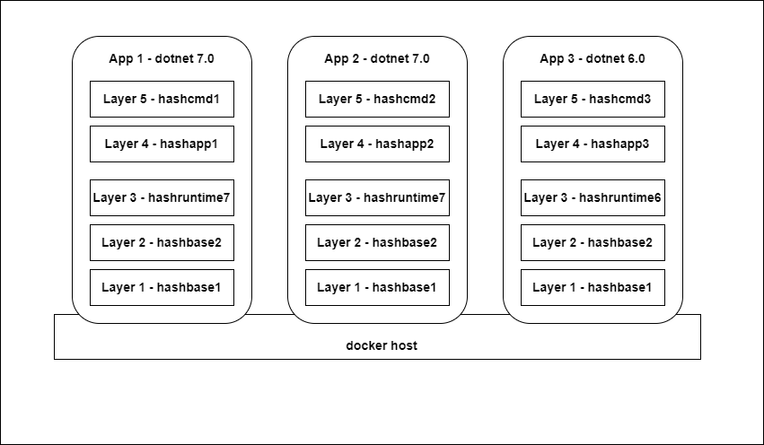

# <!--fit--> Building code with docker

---


## docker

<!--
docker mostly replaces VMs

VMs need designated RAM, own kernel

Expensive - Often more than one app per VM
-->


---

<!--
docker interface is mostly with cli

gives instructions to host, can pull from registry

-->


<!-- source - https://devstacks.wordpress.com/2017/02/02/docker-overview-and-architecture/ -->

---


<!--

-->

## image name structure

``` bash
# full image name
# repository < host >/< image name >:<tag >
docker pull docker.io/library/ubuntu:latest

# with docker.io as default host
docker pull library/ubuntu:latest

# with docker.io as default host, library as default first part
# and latest as default image tag 
docker pull ubuntu
```

---

<!--
docker pull

docker inspect ubuntu

docker run ubuntu

echo "hi there" > a_file.txt
-->


## demo - inspect image

---

<!--

-->


<!-- source - https://cto.ai/blog/docker-image-vs-container-vs-dockerfile/ -->

---

<!--

-->


<!-- source - https://dev.to/waji97/docker-image-management-3558 -->

---

<!--

-->


---

<!--
docker build . -t app1

docker run -t app1

change RUN to 3 seperate ones

see size difference
-->

## demo - create image

---

## why layers?

---


---



---


---


---

<!--

login to acr repo

talk about ARGS, ENV

talk about WORKDIR, ENV


-->

## demo - dotnet app

---

<!--  -->


---

<!--

-->

## demo - 2 stage builds

---

# Thanks for listening, any questions?

